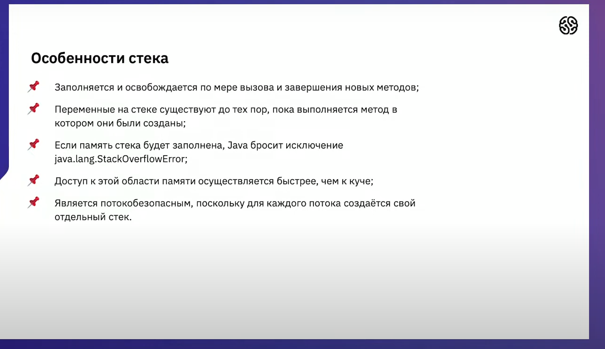

JDK - компилирует
JRE - окружение для исполнения программы
JVM - исполняет программу

javac -sourcepath ./src -d out src/MainPackage/Main.java
java -classpath ./out  MainPackage.Main

###### Очень важные строки
docker build -t java-app:demo .
docker images
docker run -it java-app:demo

## Примитивные типы

boolean - хранит неопределённое колличество памяти(зависит от jvm) но обычно считается что он хранит байт

**Разберём строку:**
char myChar = 'H';
1. char myChar = 'H'; - это инициализация
2. char myChar - это определение(обьявление)
3. char - это тип
4. myChar - это индетификатор(имя)
5. = - знак присваивания
6. 'H' - это значение

## Ссылочные типы

Это тип имеющий внутри себя ссылку, может иметь значение null.

### Массив 
Это тип имеющий ссылочное значение который ссылается на элементы массива.

int[] array3 = {5, 4, 3, 2, 1};
int[] array2 = new int[5];
int[] array1 = array2;
int[] array0;

#### Final и array 
Если: final int[] array;
То:  Не можем: array = int[] array2;
То:  Можем: array[1] = 5;

#### Не прямоугольные массивы возможны для java

При пересоздании размера массивов нижних уровней в многомерном массиве

#### Индекс это значение смещение относительно начала массива

## Операции java

Опреации в java происходит по таким приоритетам - сначала деление и умножение, слева на право, присваивание в самом конце.

### Битый не битового везёт

! - Логическое “не” (отрицание)
~ - Логическое “не” (отрицание) (битовая операция)
& - Логическое И (AND, умножение)(битовая операция)
| - Логическое ИЛИ (OR, сложение)(битовая операция)
^ - Логическое исключающее ИЛИ (XOR)(битовая операция)
&& - Условное И (сокращённое логическое И)
|| - Условное ИЛИ (сокращённое логическое ИЛИ)

## Методы java

### Почему методы а не функции
Функции внутри классов называются методами, все функции внутри Java внутри классов

### Что такое метод в java

Имя метода - это переходный глагол совершенного вида в настоящем времени.(Вернуть)(Посчитать)(Установить)(Создать)(Ввести).

Нельзя писать функции внутри функций.

Аргументы метода это ссылка на передаваемый обьект.

### Сигнатура метода

Сигнатура метода - это имя метода и его параметры. В сигнатуру метода не входит возращаемое значение. 

Нельзя написать два метода с одинаковой сигнатурой. (С одинаковым именем + колличеством параметров + типами параметров)

# Class
Класс - логическая конструкция для строительства языка джава(шаблон по которому создаются обьекты)

**Разберём строку:**
Cat cat1 = new Cat();
1. Cat cat1 = new Cat(); - это инициализация экземпляра обьекта Cat
2. Cat - тип обьекта который надо инициализировать
3. new - это оператор для динамического выделения памяти и передачи ссылки нового созданного обьекта в переменную cat
4. Cat() - это конструктор класса Cat может иметь разное колличество переменных для инициализации обьекта.

## Класс это ссылочный тип

[Пример того что перменные экземпляров класса хранят только ссылки на экземпляр](Lesson003/Ex002/src/Main.java)

## Статические методы и поля

Статические методы и поля - принадлекат не экземпляру класса а классу.

По факту их можно считать констатными полями на которые хранится ссылка в каждом обьекте

[Пример того статические переменные нельзя использовать экзеплярами класса](Lesson003/Ex003/src/Main.java)

# Распределение памяти

JVM делит память на стки и кучи.

- Приложение стек и куча всё время обмениваються друг с другом данными.

- Стек - Хранит ссылки на обьекты кучи и за хранение примитивных значений по патену LIFO(Last-In, First-Out). Переменные в стеки имею зону видимости например класса или метода. Заканчивая работу в методу верхняя часть кучи отбрасывается и заполняется новая для изменения зоны видимости. Каждый поток имеет свой стек.(Доступ к стеку)

- Куча - Содержит все обьекты созданные в нашем приложении. Со всеми своими данными внутри. Когда локальная переменная(или обьект) ссылочная ссылка храниться в стеке а примитивный обьект(или метод) в куче(но в методе могут быть локальные переменные которые опять будут хранится в стеке).
Доступ к куче медленее(она для всех потоков одна).
Куча разбита на поколения:
- Young Generation - Недавно созданные обьекты.(Когда она заполняется происходит быстрая сборка мусора)
- Old(Tenured) Generation - Долгоживущие обьекты.
- Permanent Generation - Постоянные обьекты.(С java 8 заменена на MetaSpace динамический аналог)

## Сборка мусора

1. Это процесс запускается автоматически Java, и Java решает, запускать или нет этот процесс.
2. На самом деле это дорогостоящий процесс. При запуске сборщика мусора все потоки в вашем приложеии приостанавливаются(В зависимости от типа GC).
3. На самом деле это гораздо более сложный процесс, чем просто сбор мусора и освобождение памяти.

Сборка мусора в Java останавливает все потоки. Сборка мусора бывает двух типов.
- Быстрая - эта сборка мусора в молодом поколении. В этот момет все кого не собрали в мусор помещаются в отдельное поле выживших, а молодая куча запускается новыми значениями. И уже в следующий раз сборщик мусора берёт часть из кучи выживших и часть из кучи молодых для помещения их в новую кучу выживших.
- Медленная - это сборка мусора в старом поколении и происходит она намного меньше так как затрачивает намного больше ресурсов. 

Виды сборщиков мусора(garbage collector(GC)): 
1. Последовательный - самый обычный.(Не использовать при многопоточности)
2. Паралельный - использует несколько потоков.
3. CMS - приложения на нём работаю медленее но не останавливаются во время сборки мусора. Явный вызов сборки мусора приведёт к прерыванию параленого режима.
4. G1 - предназначен для мощных компьютеров.
5. ZGC - масштабируемый мощный сборщик мусора.

# Полезные ссылки

Презентация https://docs.google.com/presentation/d/15EH3ZQFDurYhfpBN0FH_802XvVD66fMl9cQc-GgZgl0/edit?usp=sharing

Задание про интернет-магазин:

Класс «Эмуляция интернет-магазина».
1. Написать классы покупатель (ФИО, возраст, телефон), товар (название, цена) и
заказ (объект покупатель, объект товар, целочисленное количество).
2. Создать массив покупателей (инициализировать 2 элемента), массив товаров
(инициализировать 5 элементов) и массив заказов (пустой на 5 элементов).
3. Создать статический метод «совершить покупку» со строковыми параметрами,
соответствующими полям объекта заказа. Метод должен вернуть объект заказа.
4. Если в метод передан несуществующий покупатель – метод должен выбросить
исключение CustomerException, если передан несуществующий товар, метод
должен выбросить исключение ProductException, если было передано отри-
цательное или слишком больше значение количества (например, 100), метод
должен выбросить исключение AmountException.

Вызвать метод совершения покупки несколько раз таким образом, чтобы запол-
нить массив покупок возвращаемыми значениями. Обработать исключения сле-
дующим образом (в заданном порядке):
– если был передан неверный товар – вывести в консоль сообщение об ошиб-
ке, не совершать данную покупку;
– если было передано неверное количество – купить товар в количестве 1;
– если был передан неверный пользователь – завершить работу приложения
с исключением.

Вывести в консоль итоговое количество совершённых покупок после выполне-
ния основного кода приложения.

## Перечисление
[Пример Перечисления](Lesson004/Ex001.java)

[Пример Перечисления 2](Lesson004/Ex002.java)

# Внутренние классы

[Пример Вложенных классов](Lesson004/Ex003.java) - Здесь вложенный класс используется внутри внешнего.

[Пример Вложенных классов 2](Lesson004/Ex004.java) - Здесь вложенный класс используется снаружи, в программе.

[Пример Вложенных классов 3](Lesson004/Ex005.java) - Здесь вложенный класс создаётся внутри метода.

Внутриние классы + внешние = композиция

Внутриние классы созданы для того чтобы использоваться одним классом внешним.(не всегда)

Статические и не статические вложенные классы. Статический вложенный класс не хранит экземпляр внешнего класса. Статический класс может существовать сам по себе. 

Статический внутренний класс может обращаться только к статическим полям внешнего класса.

## Не статические внутренние классы

Вложенные и локальные классы - вложенный класс находится внутри другово класса, локальный класс находится внутри метода другово класса.
### Вложенные классы 
Особенности вложенных классов:
1. Внутрений класс не существует без внешнего.
2. Внутренний класс имеет доступ ко всем полям внешнего.
3. Внешний не имеет доступа к внутреннему без создания обьекта.
4. У внутренних классов классов есть модификаторы доступа.
5. Внутренний класс не может называться как внешний.
6. Во внутреннем классе нельзя иметь не-final статические поля.
7. Обьект внутреннего класса нельзя создать в статическом методе внешнего класса.(Нужен обьект внешнего класса а раз метод статический то экземпляра внешнего класса может не быть)

### Локальные классы
Особенности локальных классов:
1. Сохраняет доступ ко всем полям и методам внешнего класса.
2. Должен иметь свои внутренние копии всех локальных переменных.
3. Имеют ссылку на экземпляр окружающего метода.

## Статические внутренние классы

[Пример статического вложенного класса](Lesson004/Ex006.java) - В данном примере мы слышим как мяукает кот, но кота не видим.

# Механизм исключительных ситуаций

Исключение - это отсупление от общего правила, несоответвие обычному порядку вещей.

Ошибки бывают:
1. Кода программы.
2. Действия пользователя.
3. Апаратной части компьютера.

exception stack trace - отслеживание стека исключительной ситуации

Eror - это отдельный вид ошибок. Но есть похожий на него RuntimeException он является (unchecked) непроверяемый, то есть его можно вбросить (throw) и не обрабатывать, остальные Exception обязательны к обработке.

Ветвение исключений (Exception) и ошибок (Eror):
Throwable

    Exception
        RuntimeException
            ArithmeticException
            ClassCastException
        ClassNotFoundException
        IOException
            FileNotFoundException
            EOFException
            MalformedURLException
            UnknownHostException
            Другие подклассы IOException
        CloneNotSupportedException
        Другие подклассы Exception
    Eror
        Подклассы Eror

## Многопоточность

На старте программы запускаються потоки которые работают псведопаралельно и назначены каждый для решения своих задач.(Основной поток, Сборщик мусора, обработчик ошибок и др.) Иногда потоки обмениваются информацией. (Так исключения останавливаю ход основного потока)

## Checked Exceptions

Должно быть обработано try catch или переданно на обработку выше(В метод который вызывает данный метод).

# Файловая система

Файловая система - один из ключевых компонентов всех операционных систем. В её обязаности входит структуризация, чтение, хранение, запись файлов. Выделяют Windows-подход и Linux-подход. 
Файловая система - архитектура хранения информации, размещённой на жёстком диске и оперативной памяти.

Загрузчики:
MBR и GPT(BIOS и UEFI)(x32 и x64)
MBR - более старая версия
GPT - обратна совместима с GPT.

## Класс файл

File file = new File("file.txt");

## Path и Paths
Замета класса файл содержащяя динамические методы.

URI - Uniform Resource Identifier (униицированный идентификатор ресурса).
URL - Uniform Resource Locator (униицированный определитель местонахождения ресурса).
URN - Uniform Resource Name (униицированный имя ресурса).

## Files
Замета класса файл содержащяя статические методы.

## PipedInputStream PipedInputStream
Для многопоточности

